# ESP32 HTTPS installer components

Status: optional shared components, host-tested and ESP32 compile/link checked.
Not wired into CESH's running firmware and not physically validated. Do not flash
the compile fixture or register an unprepared device as OTA-ready.

## Implementation and data flow

```mermaid
flowchart LR
  Config[Provisioned origin, token, CA and signing keys] --> Poll[Verified HTTPS assignment poll]
  Poll --> Parse[Bounded assignment parser]
  Parse --> Verify[Signature and local compatibility checks]
  Verify --> Download[HTTPS artifact response with exact length]
  Download --> State[Persist downloading assignment]
  State --> Write[Write inactive slot in bounded chunks]
  Write --> Check[Full artifact SHA-256 and ESP image validation]
  Check --> Pending[Persist pending boot]
  Pending --> Select[Select boot partition]
  Select --> Worker[Project flush and reboot scheduling]
```

- `BardBoxOTAHTTPSConfig.h` validates a DNS/IPv4 HTTPS origin with optional port,
  URL-safe per-device token (32–256 characters), CA material and bounded timeouts.
  Paths, user information, queries and fragments are rejected in the origin. IPv6
  literals are not supported by this reference configuration parser.
- `BardBoxOTAHTTPSESP32.h` polls assignments, parses bounded responses and streams
  an assigned artifact into the writer. It sets the configured CA, disables
  redirects, requests identity encoding and requires an exact Content-Length.
  No `setInsecure()` path exists. The configured CA and valid device clock must
  actually validate the deployed server certificate before any rollout.
- `BardBoxOTAStream.h` transfers at most 1,024 bytes per step with separate idle
  and overall body budgets, yielding between steps. Disconnect, malformed reads,
  timeout or consumer failure stops the transfer. Connect/TLS/header deadlines are
  configured separately through the SDK; measure DNS and all blocking SDK calls
  on the target before claiming a complete wall-clock bound.
- `BardBoxOTAWriterESP32.h` rechecks signature/compatibility, rejects the running
  partition and unexpected slot capacity, and persists the assignment before
  erasing/writing the inactive slot. It checks exact byte count and full-file hash,
  requires `esp_ota_end` image validation, persists pending state, then selects the
  boot partition. It never restarts. It does not write the measurement filesystem.

Transport errors before assignment acceptance leave the assignment pending for a
later bounded poll. Errors after acceptance mark failure; the same generation is
not automatically reinstalled. A new operator assignment can retry. After a direct
writer `append()` failure, the calling worker must abort/report failure; the HTTPS
wrapper already does this. A failed or uncertain state commit disables further
update actions until verified reload.

## Project worker still required

CESH must supply a single OTA worker independent of acquisition, persistent device
identity/network/trust configuration, verified running artifact identity, bounded
poll/backoff scheduling and durable status emission. Call polling only when network
and time prerequisites are ready. Do not put these blocking network calls in the
acquisition task. Coalesce status writes to limit NVS wear.

On `ReadyForReboot`, first persist completed measurements and coordinate a measured
acquisition boundary, then perform a controlled restart. On boot, verify exact
running artifact identity, perform bounded local acquisition/storage/config checks,
mark the application valid through the platform API, then confirm the assignment.
Physical rollback eligibility and queue compatibility must already be commissioned.
See [verification](ota-device-verification.md) and
[partition commissioning](ota-partition-commissioning.md).

## Validation and remaining gaps

The production writer runs in host tests against an ESP API double, checking that
signature failure, wrong slot, excessive/truncated bytes, failed writes, bad hash,
image rejection and failed pending-state persistence never select a boot slot.
Boot-selection failure records failure. The successful path asserts persistence
before flash start and before boot selection. Crypto and physical flash are not
simulated by that double.

Stream tests cover exact replay, bounded chunks, stalls, disconnect, consumer/read
failure, overall timeout and millisecond wraparound. Configuration tests reject
unsafe origins, token/header injection and invalid limits. The actual ESP32 SDK
compile fixture links HTTPS, verifier, NVS state and writer together; it performs
none of these operations at startup.

Still required: live TLS/certificate failures and renewal, DNS/handshake deadlines,
power interruption at erase/write/selection, real NVS persistence, sampling timing,
heap pressure, network loss and boot rollback on a physical Feather. The CESH
14-day filesystem-image result does not establish these hardware properties.

## Scope, propagation and decisions

This is an optional Bardbox capability, with shared code owned by the template and
the contract owned by Bardbox. CESH is the first planned consuming firmware. RKC
and other transport-specific nodes should not inherit an unused OTA worker.
Consumption must be explicit and versioned when the CESH worker is integrated.
Existing operator-page behavior and sensor data processing are unchanged by these
components; their user-facing documentation and scientific formulas need no change.

The reference uses full signed artifacts and the inactive application slot rather
than storing downloads alongside measurements. This preserves offline capacity.
The rejected alternatives are unsigned images, redirecting bearer credentials,
in-place application writes and automatic reboot from the network helper. These
choices implement the already agreed OTA contract; no deployment is authorized by
successful tests. Roll out only after bench validation and the user's rollout approval.
